# ConserveFM

### Learning to Repair Physical Violations in Frozen Weather Foundation Models

<p align="center">
  <b>Post-hoc forecast repair · Physical consistency · Stress testing · Cross-backbone transfer</b>
</p>

<p align="center">
  <a href="https://github.com/cataug/ConserveFM">
    
  </a>
  
  
  
</p>

---

## Overview

**ConserveFM** studies a simple question:

> **Can a frozen weather foundation model be repaired after inference when its forecast violates physical structure?**

Rather than retraining the underlying forecasting model, ConserveFM operates as a **post-hoc repair module**. Given a frozen-model forecast, the repair network predicts a state correction while explicitly balancing:

- forecast fidelity,
- physical consistency,
- intervention magnitude,
- and robustness under structured perturbations.

The project evolved through a broad exploratory campaign and ultimately revealed an important empirical result:

> **forecast accuracy and physical consistency form a non-trivial Pareto trade-off.**

The final system therefore exposes two useful operating modes:

- **ConserveFM-Acc** — accuracy-oriented repair;
- **ConserveFM-Phys** — physics-oriented repair.

A direct-state repair baseline lies between them on the resulting accuracy–physics Pareto front.

---

## Main result

<p align="center">
  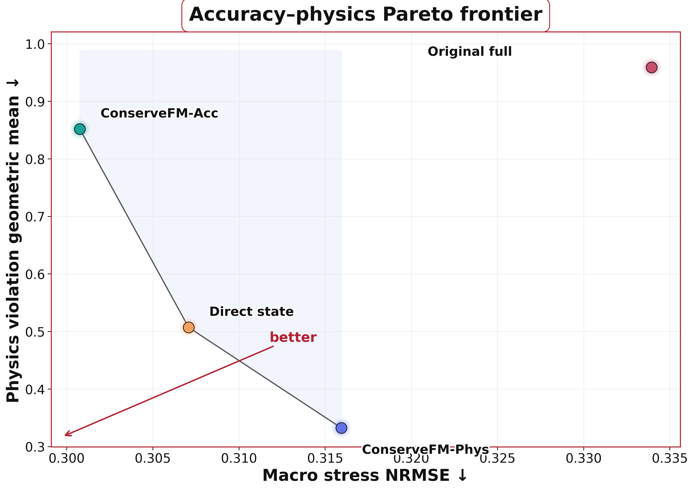
</p>

The final evaluation shows that the best predictive and best physics-oriented solutions are **not the same model**.

| Method | Clean NRMSE ↓ | Stress NRMSE ↓ | Stress ACC ↑ | Physics violation GM ↓ |
|---|---:|---:|---:|---:|
| **ConserveFM-Acc** | **0.3070** | **0.3008** | **0.9503** | 0.8520 |
| Direct state | 0.3130 | 0.3071 | 0.9487 | 0.5072 |
| **ConserveFM-Phys** | 0.3193 | 0.3159 | 0.9458 | **0.3325** |
| Original full model | 0.3164 | 0.3339 | 0.9401 | 0.9592 |

ConserveFM-Phys sacrifices roughly **5% stress NRMSE** relative to ConserveFM-Acc, while reducing the aggregate physics-violation ratio from **0.852 to 0.333**.

The original joint formulation is dominated by the refined variants.

---

## Physical consistency

<p align="center">
  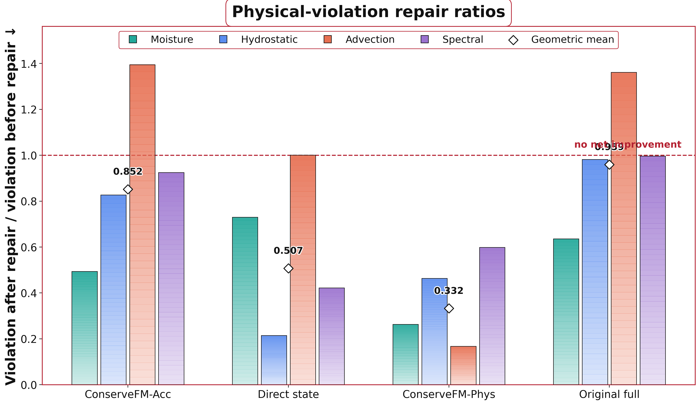
</p>

For ConserveFM-Phys, the repaired-to-corrupted physical-violation ratios are:

| Constraint | Ratio ↓ | Approx. reduction |
|---|---:|---:|
| Moisture | 0.263 | 74% |
| Hydrostatic | 0.464 | 54% |
| Advection | 0.168 | 83% |
| Spectral | 0.598 | 40% |
| **Geometric mean** | **0.333** | — |

A ratio below 1 means that the repair reduces the corresponding violation.

---

# Weather-repair atlas

ConserveFM is evaluated not only through aggregate metrics but also through **geographically resolved weather maps**.

<p align="center">
  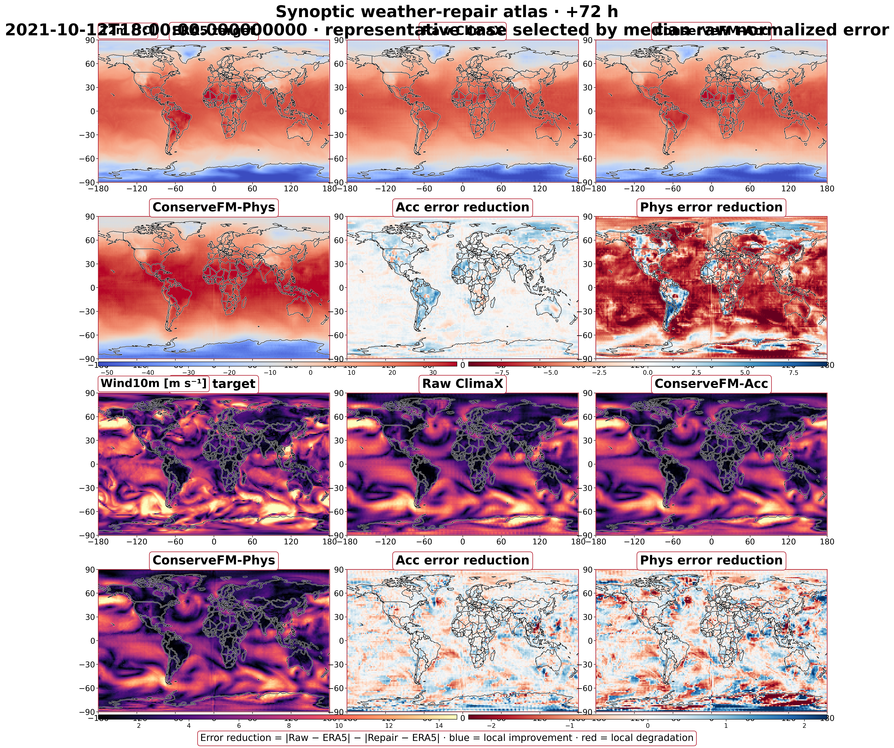
</p>

The atlas compares:

- ERA5 target,
- raw ClimaX forecast,
- ConserveFM-Acc,
- ConserveFM-Phys,
- local Acc error reduction,
- local Phys error reduction.

Representative meteorological fields include:

- Z500,
- T850,
- specific humidity,
- wind speed.

The main qualitative example is selected using **median raw normalized error**, rather than by maximizing repair improvement.

---

## Where does repair help?

<p align="center">
  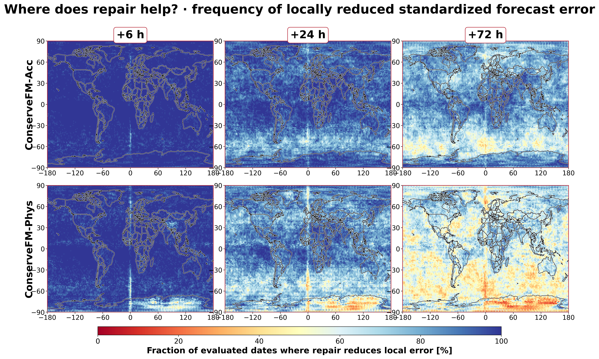
</p>

This map measures the fraction of evaluated dates for which repair reduces the local standardized forecast error.

It answers a more interpretable question than a global scalar metric:

> **Where on Earth does post-hoc repair actually help?**

---

## Mean geographic error reduction

<p align="center">
  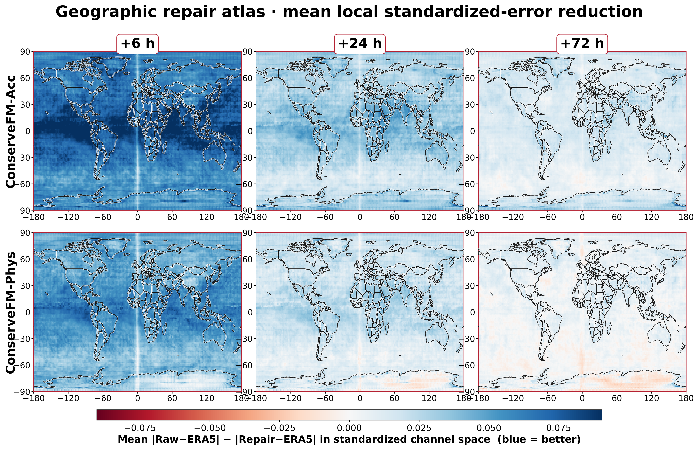
</p>

For each grid cell, we compute

\[
|\hat{x}_{raw} - x| - |\hat{x}_{repair} - x|,
\]

in standardized channel space.

Positive values indicate local improvement after repair.

---

## Geography of intervention

<p align="center">
  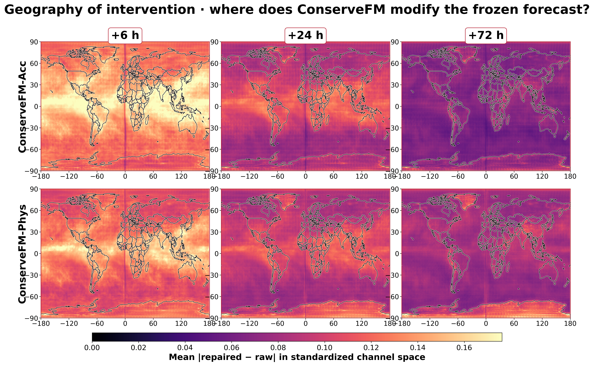
</p>

This figure visualizes where ConserveFM changes the frozen forecast most strongly.

The quantity shown is the mean normalized intervention magnitude

\[
|\hat{x}_{repair} - \hat{x}_{raw}|.
\]

---

# Experimental pipeline

The project was not built from a single hand-selected configuration.

It began with a **138-job planned campaign** spanning:

- repair formulations,
- physics constraints,
- synthetic corruption families,
- weighting strategies,
- auxiliary heads,
- multiple seeds,
- multiple forecasting backbones,
- deterministic baselines.

<p align="center">
  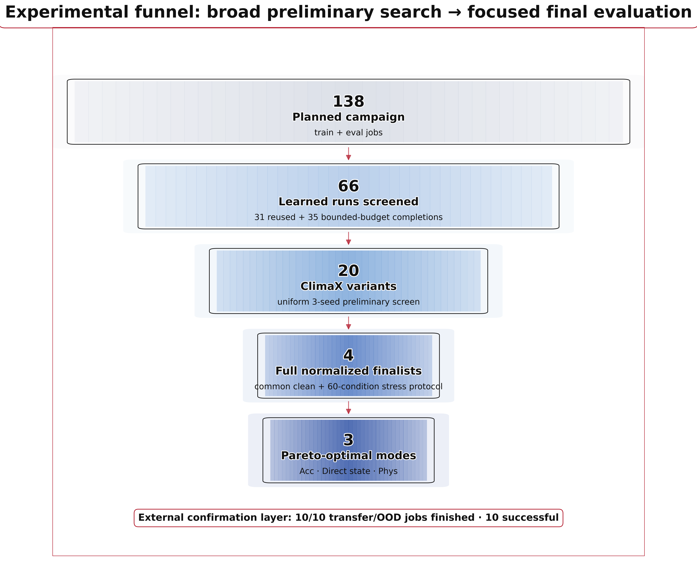
</p>

The experimental funnel was:

```text
138 planned jobs
       ↓
66 learned runs screened
       ↓
20 ClimaX variants
       ↓
4 full normalized finalists
       ↓
3 Pareto-optimal operating points
````

Of the 66 learned runs used in the preliminary screening:

* **31 existing checkpoints were reused**;
* **35 missing configurations were completed under a bounded low-compute budget**.

All candidates were then evaluated using the same lightweight stress protocol.

---

# Preliminary screening

<p align="center">
  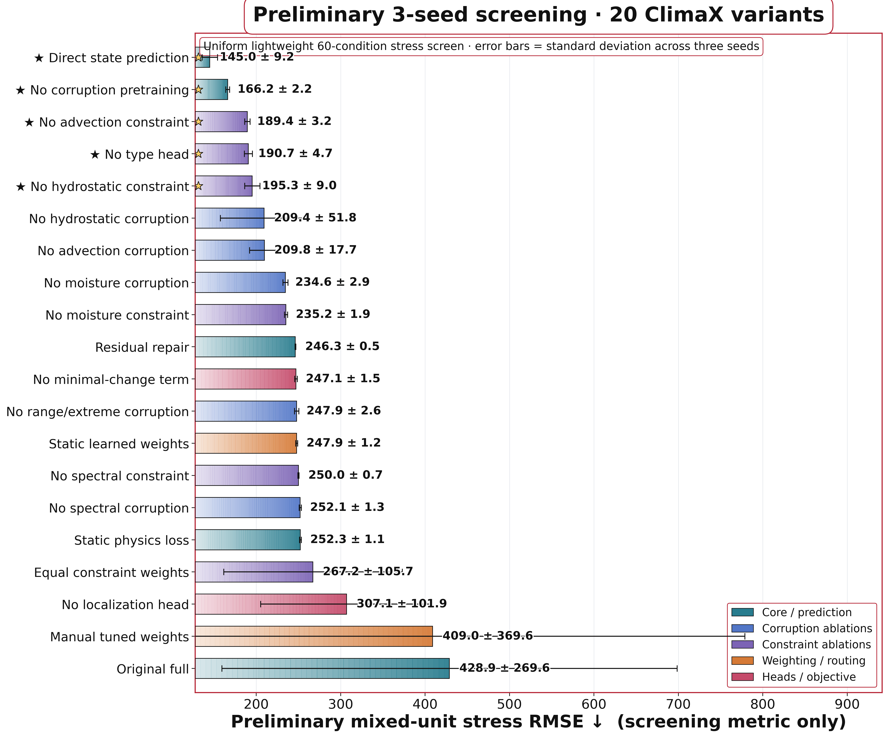
</p>

The broad preliminary screen identified **Direct State** and **No-Corruption-Pretraining** as the strongest predictive candidates.

Selected preliminary ClimaX results:

| Method                        | Seeds | Preliminary stress RMSE ↓ |       Std |
| ----------------------------- | ----: | ------------------------: | --------: |
| **Direct state prediction**   |     3 |               **144.998** |     9.164 |
| **No corruption pretraining** |     3 |               **166.150** | **2.240** |
| No advection constraint       |     3 |                   189.410 |     3.196 |
| No type head                  |     3 |                   190.654 |     4.712 |
| No hydrostatic constraint     |     3 |                   195.316 |     8.968 |
| No hydrostatic corruption     |     3 |                   209.351 |    51.833 |
| No advection corruption       |     3 |                   209.750 |    17.702 |
| Original full formulation     |     3 |                   428.878 |   269.561 |

The preliminary metric is a **mixed-unit screening diagnostic** and is not used as the headline final metric.

---

## Performance versus stability

<p align="center">
  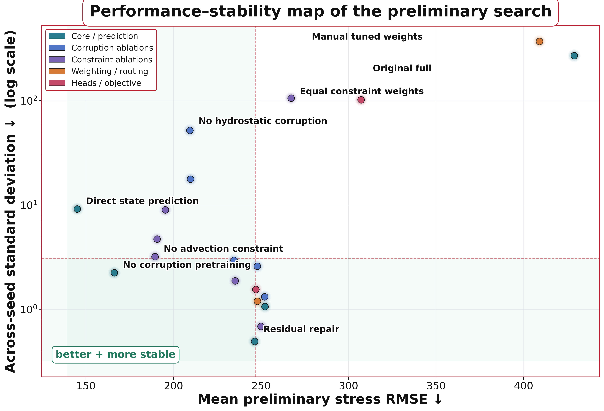
</p>

The preliminary search also exposes a clear difference between:

* consistently good variants,
* consistently poor variants,
* and highly unstable formulations.

For example, several manually balanced or jointly optimized variants exhibit very large between-seed variability.

This motivated the reduced final evaluation set.

---

## Ablation landscape

<p align="center">
  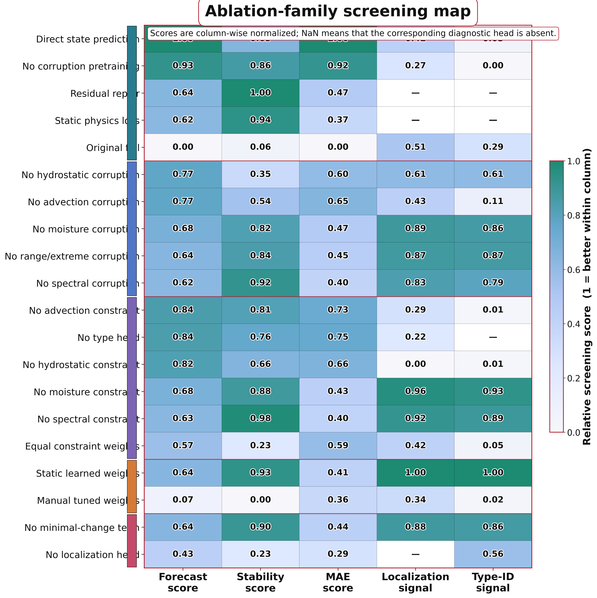
</p>

The explored families include:

### Corruption ablations

* no moisture corruption,
* no hydrostatic corruption,
* no advection corruption,
* no spectral corruption,
* no range/extreme corruption.

### Constraint ablations

* no moisture constraint,
* no hydrostatic constraint,
* no advection constraint,
* no spectral constraint.

### Weighting / routing

* equal constraint weights,
* manually tuned weights,
* static learned weights.

### Objective / architecture

* no localization head,
* no constraint-type head,
* no minimal-change term,
* direct state prediction,
* residual repair,
* static physics loss.

---

# Stress-test protocol

The final stress benchmark contains:

* **3 forecast leads:** +6 h, +24 h, +72 h;
* **5 corruption types;**
* **4 severity levels.**

This produces

$3 \times 5 \times 4 = 60$

matched stress conditions.

The synthetic corruption families are:

1. moisture / mass leakage,
2. hydrostatic inconsistency,
3. advection inconsistency,
4. spectral artifacts,
5. invalid-range / extreme-value artifacts.

---

## Stress anatomy

<p align="center">
  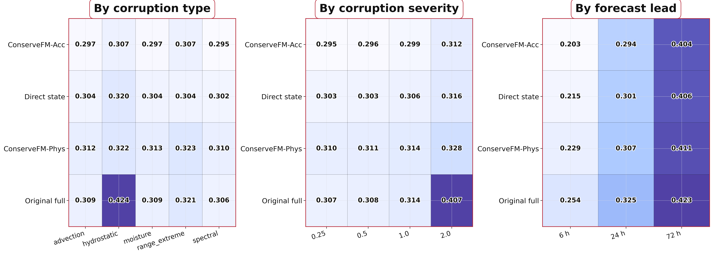
</p>

The stress analysis is decomposed by:

* corruption family,
* corruption severity,
* forecast lead.

This avoids reducing robustness to a single aggregate number.

---

# Uncertainty analysis

The final models are fully evaluated for **training seed 42**.

To quantify uncertainty across the matched stress benchmark, we use a **paired bootstrap over the 60 lead × corruption × severity conditions**.

This is deliberately not presented as multi-seed uncertainty.

### Paired stress-NRMSE differences

Difference is defined as:

$\mathrm{ConserveFM\text{-}Acc} - \mathrm{competitor}.$

Negative values favor ConserveFM-Acc.

| Comparison            | Mean difference |     95% bootstrap CI |
| --------------------- | --------------: | -------------------: |
| Acc − Direct state    |        -0.00631 | [-0.00868, -0.00385] |
| Acc − ConserveFM-Phys |        -0.01517 | [-0.01726, -0.01320] |
| Acc − Original full   |        -0.03319 | [-0.05962, -0.01327] |

The paired intervals exclude zero for all three comparisons.

---

# Model

ConserveFM receives:

* a frozen foundation-model forecast,
* the previous atmospheric state,
* forecast lead time.

The repair network predicts a normalized state correction

$\Delta x$

and outputs

$\hat{x}^{*}=\hat{x}+\Delta x.$

The training objective combines forecast repair with physical consistency and intervention regularization.

The project explored four physical constraints:

* moisture / mass consistency,
* hydrostatic consistency,
* advection consistency,
* spectral consistency.

---

## Accuracy-oriented mode

**ConserveFM-Acc** corresponds to the strongest accuracy-oriented model found in the screening campaign.

It achieves the best final:

* clean normalized RMSE,
* stress normalized RMSE,
* stress anomaly correlation.

---

## Physics-oriented mode

**ConserveFM-Phys** uses forecast-matched synthetic repair training and train-derived physical normalization scales.

Its objective is not to maximize raw predictive accuracy alone.

Instead, it provides the strongest aggregate reduction in physical violations and occupies a different point on the accuracy–physics Pareto frontier.

---

# Important negative result

The original formulation used an adaptive router to weight physical constraints.

During diagnosis, the router collapsed toward low-cost constraints and the auxiliary corruption-type head became highly degenerate.

The project therefore treats the original formulation as a **negative ablation**, not as the final method.

Final auxiliary-head performance is also weak:

* corruption-type accuracy is close to the 5-class random baseline;
* localization IoU remains low.

Accordingly, the final scientific claim is **not** that ConserveFM reliably identifies corruption types or localizes violation masks.

The supported claim is instead:

> **post-hoc forecast repair exposes an accuracy–physics trade-off and can substantially improve physical consistency without retraining the frozen forecasting backbone.**

---

# Backbones

The project contains experiments involving:

### ClimaX

Primary forecasting backbone and primary full evaluation target.

### FourCastNet

Used for cross-backbone transfer analysis.

### Prithvi WxC

Used as an ERA5-adapted transfer setting with shared atmospheric fields.

Because the Prithvi experiment requires an adaptation between ERA5 and the model's native data formulation, it should be interpreted as a transfer diagnostic rather than an identical-data comparison.

---

# Data

## ERA5 / WeatherBench2

Primary gridded atmospheric data.

Approximate project configuration:

* temporal resolution: 6 h,
* spatial resolution: 1.5°,
* grid: 240 × 121,
* pressure levels: 13,
* expanded atmospheric channels: 71.

Research split:

* train: 1979–2018,
* validation: 2019–2020,
* test: 2021–2022.

The full ERA5 store is **not included in this repository**.

---

## GHCN

Used as an external observational / station-based evaluation source.

* validation: 2019–2020,
* test: 2021–2022.

Large observation caches are intentionally excluded from Git.

---

## ISD

2023 observations are reserved for external / OOD evaluation.

---

# Repository structure

```text
ConserveFM/
├── conservefm/                  # core repair implementation
├── src/                         # project source code
│
├── tools/
│   ├── train_conservefm.py
│   ├── eval_conservefm.py
│   ├── final_metrics_from_existing.py
│   ├── final_bootstrap_analysis.py
│   ├── build_final_paper_tables.py
│   ├── run_parallel_plan.py
│   ├── run_prelim20_salvage.sh
│   ├── prelim20_live_stats.py
│   ├── make_wow_history_figures_v2.py
│   ├── make_prelim_screen_figures_v2.py
│   └── make_weather_atlas_v2.py
│
├── manifests/
│   ├── experiments_v1/
│   ├── research_v1/
│   ├── research_smart12k_v1/
│   └── research_prithvi_transfer_v1/
│
├── reports/
│   ├── final_metrics_s42/
│   ├── prelim20_salvage/
│   ├── iclr_extra_*/
│   └── wow_history_figures_v2/
│
├── logs/
│
├── assets/
│   └── geography/               # Natural Earth outlines for weather atlases
│
└── README.md
```

Large datasets, forecast stores, model weights, checkpoints, and caches are intentionally excluded from Git.

---

# Environment

The experiments were run on:

* NVIDIA A100 40 GB,
* CUDA 12.4,
* PyTorch 2.6,
* Python 3.12.

The project separates the main ML environment from the data-processing environment.

Example project configuration:

```bash
PY="$HOME/Malashin_Projects/.venv_a100/bin/python"

DATA_PY="$HOME/ConserveFM/.venv_data/bin/python"

DATA_SITE=$(
  "$DATA_PY" -c \
  'import site; print(site.getsitepackages()[0])'
)

PYTHONPATH="$HOME/ConserveFM:$DATA_SITE" \
"$PY" tools/eval_conservefm.py ...
```

---

# Reproducing analysis from existing artifacts

The repository contains lightweight experiment metadata and evaluation artifacts.

## Final tables

```bash
python tools/build_final_paper_tables.py
```

Outputs include:

```text
reports/final_metrics_s42/paper/
├── table1_main_results.csv
├── table1_main_results.md
├── table1_main_results.tex
├── table2_stress_breakdown.csv
├── table3_physics_diagnostics.csv
└── accuracy_physics_pareto.csv
```

---

## Bootstrap analysis

```bash
python tools/final_bootstrap_analysis.py
```

The bootstrap uses the matched 60-condition stress benchmark.

---

## Preliminary-screen figures

```bash
python tools/make_prelim_screen_figures_v2.py
```

Produces the broad method-ranking, stability, ablation-family, and experimental-funnel figures.

---

## Main experiment-history figures

```bash
python tools/make_wow_history_figures_v2.py
```

---

## Weather atlas

If the weather-atlas cache already exists:

```bash
python tools/make_weather_atlas_v2.py
```

The script reuses the cache and redraws the geographical figures.

To rebuild the inference cache explicitly:

```bash
ATLAS_REBUILD=1 \
ATLAS_CASES_PER_LEAD=32 \
python tools/make_weather_atlas_v2.py
```

---

# Key figures

| Figure                                        | Description                                    |
| --------------------------------------------- | ---------------------------------------------- |
| `fig05_stress_anatomy`                        | robustness by corruption, severity, and lead   |
| `fig06_accuracy_physics_pareto`               | final accuracy–physics Pareto front            |
| `fig07_physics_violation_ratios`              | repaired / corrupted physical-violation ratios |
| `fig09_preliminary_20method_ranking`          | broad 3-seed preliminary method screen         |
| `fig10_preliminary_performance_stability`     | performance vs cross-seed variability          |
| `fig11_preliminary_ablation_family_heatmap`   | ablation-family overview                       |
| `fig12_preliminary_to_final_funnel`           | full experimental funnel                       |
| `fig13_synoptic_weather_atlas_representative` | representative geographical case study         |
| `fig14_geographic_repair_frequency`           | where repair helps most often                  |
| `fig15_geographic_mean_error_reduction`       | mean local error improvement                   |
| `fig16_geographic_repair_magnitude`           | where ConserveFM intervenes                    |
| `fig17_lead_time_weather_atlas`               | +6/+24/+72 h synoptic comparison               |

---

# Experimental philosophy

This repository intentionally retains both:

* successful models,
* unsuccessful formulations,
* diagnostic scripts,
* intermediate experimental evidence.

This is useful because the final method was not obtained from a single isolated run.

The experimental trajectory revealed several important failure modes:

* objective gaming by adaptive constraint routing,
* scale imbalance between physical losses,
* instability under naive joint optimization,
* weak auxiliary localization/type prediction,
* backbone-specific transfer difficulty.

The final ConserveFM variants are the result of diagnosing these behaviors rather than hiding them.

---

# Current interpretation

The evidence supports three conclusions.

### 1. Post-hoc repair can improve frozen forecasts

The best accuracy-oriented repair improves predictive robustness relative to the original full formulation and direct-state baseline.

### 2. Strong physical consistency requires a different operating point

The strongest physics-oriented model does not maximize predictive accuracy.

Instead, it produces substantially lower aggregate physical violations.

### 3. The accuracy–physics trade-off is measurable

ConserveFM-Acc, Direct State, and ConserveFM-Phys occupy distinct Pareto-optimal positions.

This suggests that post-hoc weather-model repair should be treated as a **multi-objective problem**, rather than as a single scalar optimization task.

---

# Limitations

The current results should be interpreted with the following limitations.

* Final full normalized results are reported for **one fully evaluated training seed**.
* Bootstrap uncertainty is over matched stress conditions, not training stochasticity.
* Synthetic perturbations remain a major component of the robustness benchmark.
* The auxiliary localization and corruption-type heads are not strongly discriminative in the final setting.
* Cross-backbone transfer remains more heterogeneous than the primary ClimaX evaluation.
* Some transfer settings require variable or dataset adaptation.

These limitations are intentionally preserved in the repository rather than hidden behind aggregate metrics.

---

# Lightweight artifacts vs. excluded data

GitHub contains:

* source code,
* experiment manifests,
* lightweight metrics,
* analysis tables,
* logs,
* publication figures,
* weather-atlas visualizations.

GitHub does **not** contain:

* the full ERA5 archive,
* large GHCN caches,
* forecast Zarr stores,
* large pretrained foundation-model weights,
* ConserveFM checkpoints,
* temporary inference caches.

This keeps the repository inspectable without committing hundreds of gigabytes of data.

---

# Citation

The manuscript associated with this repository is currently in preparation.

If you use the code before a formal citation becomes available, please cite the repository:

```bibtex
@software{conservefm2026,
  author       = {Ivan Malashin and collaborators},
  title        = {ConserveFM: Learning to Repair Physical Violations in Frozen Weather Foundation Models},
  year         = {2026},
  url          = {https://github.com/cataug/ConserveFM}
}
```

---

# Repository

**GitHub:**
[https://github.com/cataug/ConserveFM](https://github.com/cataug/ConserveFM)

---

<p align="center">
  <b>ConserveFM</b><br>
  Repair the forecast — without retraining the forecaster.
</p>
```
